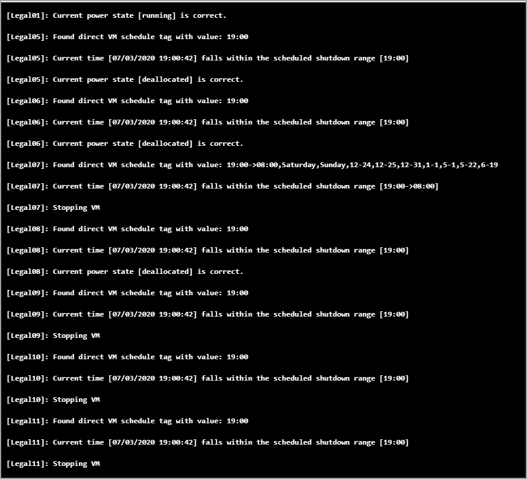
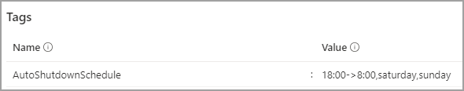
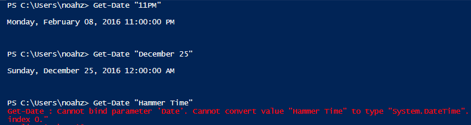
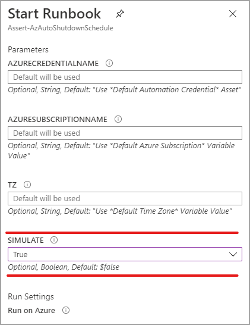
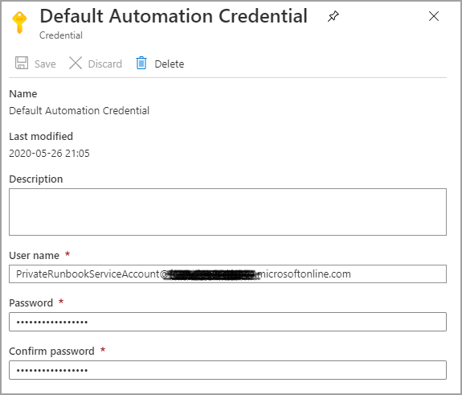
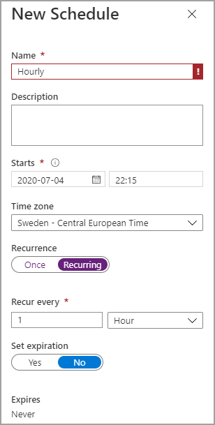

# Scheduled Virtual Machine Shutdown/Startup - Microsoft Azure

## Table of Contents
- [Why use This](https://github.com/tomasrudh/AutoShutdownSchedule#why-use-this)
- [Credits](https://github.com/tomasrudh/AutoShutdownSchedule#credits)
- [What it does](https://github.com/tomasrudh/AutoShutdownSchedule#what-it-does)
- [Tag-based power schedule](https://github.com/tomasrudh/AutoShutdownSchedule#tag-based-power-schedules)
- [Tag content](https://github.com/tomasrudh/AutoShutdownSchedule#tag-content)
  - [Get to know datetime](https://github.com/tomasrudh/AutoShutdownSchedule#get-to-know-datetime)
- [Schedule tag examples](https://github.com/tomasrudh/AutoShutdownSchedule#schedule-tag-examples)
- [What the runbook does](https://github.com/tomasrudh/AutoShutdownSchedule#what-the-runbook-does)
- [Runbook logs](https://github.com/tomasrudh/AutoShutdownSchedule#runbook-logs)
- [Performance](https://github.com/tomasrudh/AutoShutdownSchedule#performance)
- [Testing](https://github.com/tomasrudh/AutoShutdownSchedule#testing)
- [Azure modules](https://github.com/tomasrudh/AutoShutdownSchedule#azure-modules)
- [Setting it up in Azure](https://github.com/tomasrudh/AutoShutdownSchedule#setting-it-up-in-azure)
  - [Prerequisites](https://github.com/tomasrudh/AutoShutdownSchedule#prerequisites)
  - [Import runbook](https://github.com/tomasrudh/AutoShutdownSchedule#import-runbook)
  - [Create credential asset](https://github.com/tomasrudh/AutoShutdownSchedule#create-credential-asset)
  - [Create variables for subscription name and time zone](https://github.com/tomasrudh/AutoShutdownSchedule#create-variables-for-subscription-name-and-time-zone)
  - [Schedule the runbook](https://github.com/tomasrudh/AutoShutdownSchedule#schedule-the-runbook)
  - [Configure shutdown schedule tags](https://github.com/tomasrudh/AutoShutdownSchedule#configure-shutdown-schedule-tags)
  - [Initial testing](https://github.com/tomasrudh/AutoShutdownSchedule#initial-testing)
  - [Troubleshooting](https://github.com/tomasrudh/AutoShutdownSchedule#troubleshooting)
  - [Automation account configuration](https://github.com/tomasrudh/AutoShutdownSchedule#automation-account-configuration)
  

## Why Use This?
Money! The largest share of Azure subscription costs when using Virtual Machines (IaaS) is the compute time: how many hours the VMs are running per month. If you have VMs that can be stopped during certain time periods, you can reduce the bill by turning them off (and “deallocating” them).

Unfortunately, Microsoft doesn’t include any tools to directly manage a schedule like this. That’s what this runbook helps achieve without 3rd party management tools or chaining a junior admin to the keyboard for 6AM wakeup call.

## Credits

Let me start by saying this script was not invented originally by me, I have copied the script from Automys and made tweeks and improvements. I have Automys consent to publish this script. The original can be found here: https://automys.com/library/asset/scheduled-virtual-machine-shutdown-startup-microsoft-azure

## What It Does
This runbook automates scheduled startup and shutdown of Azure virtual machines. You can implement multiple granular power schedules for your virtual machines using simple tag metadata in the Azure portal or through PowerShell. For example, you could tag a single VM or group of VMs to be shut down between the hours of 10:00 PM and 6:00 AM, all day on Saturdays and Sundays, and during specific days of the year, like December 25.

The runbook is intended to run on a schedule in an Azure Automation account, with a configured subscription and associated access credentials. For example, it can run once every hour, checking all the schedule tags it finds on your virtual machines or resource groups. If the current time falls within a shutdown period you’ve defined, the runbook will stop the VM if it is running, preventing any compute charges. If the current time falls outside of any tagged shutdown period, this means the VM should be running, so the runbook starts any such VM that is stopped. It is possible to set a time of the day when the machine should be shut down, but never started automatically, so you don't forget to turn it off in the evening.

Once the runbook is in place and scheduled, the only configuration required can be done through simple tagging of resources, and the runbook will implement whatever power schedules it finds during its next scheduled run. Think of this as a quick and basic power management scheduling solution for your Azure virtual machines.

This runbook do only handle RM virtual machines and not classic.

## Tag-based Power Schedules
If our goal is to manage the times that our virtual machines are shut down and powered on, we need a way to define this schedule. For example, perhaps we want to shut down our VMs after close of business and have them start up before people arrive in the office in the morning. But we also might want them shut down all weekend, not just at night. And what about holidays? Clearly, we also need an approach that allows some flexibility to get granular with scheduling.

The first thing we might think to use is a runbook schedule, which Azure already provides out of the box. In essence, we can configure a runbook to run hourly or daily and do a task like shutting down VMs. But as just discussed, what if you have multiple schedules for different VMs? And that’s for shutting down – what about starting them again? Do you use multiple runbooks following multiple schedules? This starts to get confusing and awkward to manage. Unfortunately most of the existing examples I came across followed this kind of approach.

When you think about it, the power schedule applies to the resource, not to the runbook. The alternative approach used by the runbook solution here described is to tag a VM with a schedule, so that the mechanism used to stop and start VMs is transparent – it just happens when you declare that it should. If you’re especially nerdy when it comes to programming, you might recognize this as a declarative rather than imperative approach. It doesn’t use PowerShell Desired State Configuration (yet?), but is in the same spirit.

So what does it look like? We simply apply a tag to a virtual machine or an Azure resource group that contains VMs. This tag is a simple string that describes the times the VM should be shut down.

## Tag Content
The runbook looks for a tag named “AutoShutdownSchedule” assigned to a virtual machine or resource group containing VMs. The value of this tag is one or more schedule entries, or time ranges, defining when VMs should be shut down. By implication, any times not defined in the shutdown schedule are times the VM should be online. So, each time the runbook checks the current time against the schedule, it makes sure the VM is powered on or off accordingly.

There are three kinds of entries:

Time range: two times of day or absolute dates separated by ‘->’ (dash greater-than). Use this to define a period of time when VMs should be shut down.

Day of week / Date: Interpreted as a full day that VMs should be shut down.

Time only: the hour the machine should be shut down, the time has to be the only value in the tag, this machine will never be automatically started.

### Get to Know DateTime
All times must be strings that can be successfully parsed as “DateTime” values. In other words, PowerShell must be able to look at the text value you provide and say “OK, I know how to interpret that as a specific date/time”. There is a surprising amount of flexibility allowed, and the easiest way to verify your choice is to open a PowerShell prompt and try the command `Get-Date '<time text>'`, and see what happens. If PowerShell spits out a formatted timestamp, that’s good. If it complains that it doesn’t know what you mean, try writing the time differently.

## Schedule Tag Examples
The easiest way to write the schedule is to say it first in words as a list of times the VM should be shut down, then translate that to the string equivalent. Remember, any time period not defined as a shutdown time is online time, so the runbook will start the VMs accordingly. Let’s look at some examples:

- Shut down from 10PM to 6 AM UTC every day
  - 10pm->6am
- Shut down from 10PM to 6 AM UTC every day (different format, same result as above)
  - 22:00->06:00
- Shut down from 8PM to 12AM and from 2AM to 7AM UTC every day (bringing online from 12-2AM for maintenance in between)
  - 8PM->12AM, 2AM -> 7AM
- Shut down all day Saturday and Sunday (midnight to midnight)
  - Saturday, Sunday
- Shut down from 2AM to 7AM UTC every day and all day on weekends
  - 2:00->7:00, Saturday, Sunday
- Shut down on Christmas Day and New Year’s Day
  - December 25, January 1
- Shut down from 2AM to 7AM UTC every day, and all day on weekends, and on Christmas Day
  - 2:00->7:00, Saturday, Sunday, December 25
- Shut down always – I don’t want this VM online, ever
  - 0:00 -> 23:59:59
- Shut down at 5PM, but never start
  - 17:00

## What the Runbook Does
The runbook AutoShutdownSchedule is an Azure Automation runbook. It can be run once at a time manually, but is intended to be configured to run on a schedule, e.g. once per hour.

The runbook expects three parameters: the name of the Azure subscription that contains the VMs, the name of an Azure Automation credential asset with stored username and password for the account to use when connecting to that subscription and the timezone you are in. If not specifically configured, the runbook will try by default to find a credential asset named “Default Automation Credential” and a variable asset named “Default Azure Subscription”. Setting these up is discussed in more detail below. There is a fourth parameter called "Simulate" which, if True, tells the runbook to only evaluate schedules but not enforce them. This is discussed further below.

Once successfully authenticated to the target subscription, the runbook looks for any VM or resource group that has a tag named “AutoShutdownSchedule”. Any resource groups without this specific tag are ignored. For each tagged resource found, we next look at the tag values to see what the schedule entries are. Each is inspected and compared with the current time. Then, one of several decisions is made:

If the current time is outside of the defined schedules, the runbook concludes that this is “online time” and starts any directly or indirectly tagged VM that is currently powered off.

If the current time matches any of the schedules, the runbook concludes that this is “shutdown time” and stops any directly or indirectly tagged VM that is currently powered on.

If the tag contains a single time value, will the machine be turned off at that time. It will not be turned on at other times.

If any of the defined schedules can’t be parsed (PowerShell doesn’t understand “beer thirty”), it will ignore that and treat whatever was intended as online time. Therefore, **the default failsafe behavior is to keep VMs online** or start them, not shut them down.

## Runbook Logs
Various output messages are recorded by the runbook every time it runs, indicating what actions were taken and whether any errors occurred in processing tags or accessing the subscription. These logs can be found in the output of each job.

## Performance
Startup and shutdown are done in parallell. The machines are started in alphabetical order by their names.

## Testing
To test the runbook without actually starting or stopping your VMs, you can use the "Simulate" option. If true, the schedules will be evaluated but no power actions will be taken. You can then see whether everything would have worked as you expect before setting up the runbook to run live (runbook runs live by default).

## Azure Modules

You need to add these modules to your Automation account, do not add all Az modules.
  - Az.Accounts
  - Az.Compute
  - Az.Resources

# Setting it up in Azure
Now we’ll go through the steps to get this working in your subscription. It will be beer thirty before you know it.

## Prerequisites
This is an Azure Automation runbook, and as such you’ll need the following to use it:
  - Microsoft Azure [subscription](http://azure.microsoft.com/) (including trial subscriptions)
  - Azure Automation account created in subscription ([instructions](https://docs.microsoft.com/en-us/azure/automation/automation-create-standalone-account))
  - Runbook file downloaded from this page

## Import Runbook
The runbook is contained in the file "AutoShutdownSchedule.ps1" within the download. You can import this into your Automation Account like so:
- Open subscription in [Azure portal](https://portal.azure.com)
- Open the Automation Account which will contain the runbook
- Open the **Runbooks** view from the Resources section
- Click **Add a runbook** from the top menu
- Select **Import an existing runbook**
- Click **Create to upload**
- Confirm "AutoShutdownSchedule" now appears in the runbooks list
- Open the runbook from the list
- Click **Edit** from the top menu
- Click **Publish** from the top menu and confirm
- Confirm the runbook now shows a status of **Published**

## Create Credential Asset
When the runbook executes, it accesses your subscription with credentials you configure. By default, it looks for a credential named "Default Automation Credential". This is for a user you create in your subscription's Azure Active Directory which is granted permissions to manage subscription resources, e.g. as a co-administrator. The steps:

- Create an Azure Active Directory user for runbook use if you haven’t already. This account will be the "service account" for the runbook and **must be a co-administrator** in the target subscription.
- Open subscription in [Azure portal](https://portal.azure.com)
- Open the **Automation Account** which will contain the runbook
- Open the **Assets** view from the resources section
- Open the **Credentials** view
- Click Add a credential from the top menu
- Enter details for the new credential. Recommended to use name "**Default Automation Credential**".
- Click **Create**

## Create Variables for Subscription Name and time zone
The runbook also needs to know which subscription to connect to when it runs. In theory, a runbook can connect to any subscription, so we must specify one in particular. This is easily done by setting up a variable in our automation account.
- Open subscription in [Azure portal](https://portal.azure.com)
- Note your target subscription name as shown in Browse > Subscriptions
- Open the Automation Account which will contain the runbook
- Open the **Assets** view from the resources section
- Open the **Variables** view
- Click **Add a variable** from the top menu
- Give the variable a name ("**Default Azure Subscription**" expected by default), and enter the subscription name as the variable’s value. Click **Create**.
- Click **Add a variable** from the top menu again
- Give the variable a name ("**Default Time Zone**" expected by default), and enter the time zone name as the variable’s value, for example "W. Europe Standard Time". Use the Powershell command `Get-TimeZone -ListAvailable` to see all recognized time zones.  Click **Create**.

## Schedule the Runbook
The runbook should be scheduled to run periodically. As previously discussed, this does not determine the power on/power off schedule. It only determines how often the power schedules on resources are checked. Azure allows up to an hourly frequency, so we’ll take advantage of that:
- Back in the runbooks list, open the new runbook "Asset-AutoShutdownSchedule"
- Open the **Schedules view** under details
- Click **Add a schedule** in top menu
- Click **Link a schedule** to your runbook
- Click **Create a new schedule**
- Provide a name like "Hourly Runbook Schedule"
- Set the start time to time you want to first run, e.g. the next upcoming hour mark
- Set **Recurrence** to Hourly
- Click **Create**
- (Optional) If you want to provide a credential or subscription name directly and didn’t use the default names, click **Configure** your runbook parameters
- (Optional) Enter the name of the credential asset the runbook should use
- (Optional) Enter the name of the subscription the runbook should use
- Click **OK** to close the open dialogs
- Confirm the schedule now appears in the list with status **Enabled**

The runbook will now run every hour and perform power actions as indicated by the tags on resource groups and virtual machines in your subscription.

## Configure Shutdown Schedule Tags
Finally, we need to tag our VM resource groups. The tag format was discussed above. To create schedule tags:
- Open subscription in [Azure portal](https://portal.azure.com)
- Navigate to **Browse > Resource Groups**, and open a resource group that contains VMs to schedule
- Click the tag icon in the upper right
- In the **Key** field, enter "AutoShutdownSchedule"
- In the **Value** field, enter a schedule as discussed above, such as "10PM -> 6AM"
- Click **Save** in the top menu

After repeating this process for each VM resource group in your subscription, everything is set to automatically shut down and start up your virtual machines. Going forward, you can simply update the tag as needed to adjust the schedule, and add a tag to new resource groups that require a shutdown schedule. Remember, VMs in untagged resource groups will not be managed by the runbook.

## Initial Testing
To validate that the runbook works, we can run an initial test manually and inspect the results. This is easy:
- Assign a shutdown schedule tag to the VM or resource group you want to use for testing. Give it a schedule the covers the current time. The easiest way is to just use today’s day of the week, e.g. "Wednesday".
- Start the test VM(s)
- In the runbook view under your automation account, click the **Start** button from the top menu.
- Verify the parameters are correct if you opted not to use the defaults. Set **Simulation** to True in order to test without making changes. Verify **Run** on Azure is selected and click **OK**
- Open the **Output** view, and wait for the runbook to execute. It takes a minute or two to queue and run.

At this point, we hope to see messages in the output telling us a tagged VM or resource group was found, that the current time is within a shutdown schedule, and that the intended VMs would have been stopped in a normal execution. Any errors that occur should also be recorded in the output.

Now, test the opposite case: starting VMs that should be running according to the schedule (if they aren’t in an explicitly-defined shutdown period, they should be started). So, we can update our schedule tag and test again as follows:

Go back to the test VM or resource group and set the AutoShutdownSchedule such that it doesn’t cover the current time. For example, if today is Wednesday, set the tag value to "Tuesday". Setting the tag again and saving overwrites any existing tag with the same name. (Hint: you can use the dropdown to select previous tag keys and values).

Now start the runbook again using the same steps as before and watch the output

This time, we should see that the current time doesn’t match any shutdown schedules for the VM or group, and see the runbook report that it would have started the intended VMs.

## Troubleshooting
To check for problems, you can inspect the runbook job history to look at the output and streams / history for each individual job. In the new portal, the output view doesn't necessarily show error details, so make sure to check the Streams view as well.

## Automation Account Configuration
Before putting this runbook into production where you count on it to reliably manage your VM power state, I recommend configuring your automation account as a “Basic” rather than a free account. This ensures that the 500 minute monthly run time limitation will not be hit and prevent the runbooks from working. The cost is extremely low for additional minutes, so the few extra dollars, if any, will easily be offset by the compute time savings.

This can be changed in the "Pricing Tier" view under the automation account in the portal at [Azure portal](https://portal.azure.com)
